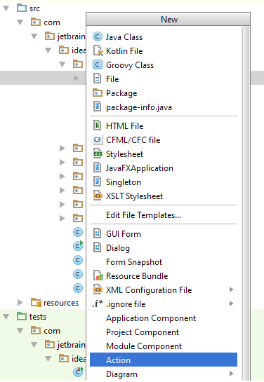

# 交互处理
插件可以在菜单或者工具栏增加自己的元素来自定义UI。IntelliJ平台提供类`AnAction`，其`actionPerformed`方法会在每次选择菜单或者点击工具栏按钮时调用。
创建自定义的交互行为，需要如下两步：
* 在插件内部，定义一个或者一组交互，并且添加到菜单或者工具栏中。
* 注册交互

## 定义交互
交互是一个`AnAction`的子类。在插件中，新建一个Java类，并继承于`AnAction`。在交互的类中，复写`actionPerformed`方法。以便在菜单选择或者工具栏按钮点击时触发自定义逻辑。
为了更清楚地阐述交互如何定义的，下面演示如何定义一个继承自`AnAction`的交互`TextBoxes`：

```java
public class TextBoxes extends AnAction {
    // If you register the action from Java code, this constructor is used to set the menu item name
    // (optionally, you can specify the menu description and an icon to display next to the menu item).
    // You can omit this constructor when registering the action in the plugin.xml file.
    public TextBoxes() {
        // Set the menu item name.
        super("Text _Boxes");
        // Set the menu item name, description and icon.
        // super("Text _Boxes","Item description",IconLoader.getIcon("/Mypackage/icon.png"));
    }
 
    public void actionPerformed(AnActionEvent event) {
        Project project = event.getData(PlatformDataKeys.PROJECT);
        String txt= Messages.showInputDialog(project, "What is your name?", "Input your name", Messages.getQuestionIcon());
        Messages.showMessageDialog(project, "Hello, " + txt + "!\n I am glad to see you.", "Information", Messages.getInformationIcon());
    }
}
```
注意：同样你也可以定义一类（多个）从`AnAction`派生出来的交互。

## 注册交互
定义好一个或者一类交互后，接下来你需要将这些交互注册到指定的菜单下或者工具栏中。可以使用如下的方式进行注册：
* 在`plugin.xml`中的`<actions>`部分进行注册
* 使用Java API进行注册
接下来会详细描述着两种注册方式，也可以参考[IntelliJ平台交互系统](http://www.jetbrains.org/intellij/sdk/docs/basics/action_system.html)获取更详细的信息。

## 在`plugin.xml`中注册交互
在`plugin.xml`中的`<actions>`部分，增加交互的配置即可实现交互注册。如下代码示例，就会增加`Sample Menu`菜单组，并且注册点击`Sample Menu->Text Boxes`和`Sample Menu->Show Dialog menu`的交互：


```xml
<actions>
  <group id="MyPlugin.SampleMenu" text="_Sample Menu" description="Sample menu">
    <add-to-group group-id="MainMenu" anchor="last"  />
       <action id="Myplugin.Textboxes" class="Mypackage.TextBoxes" text="Text _Boxes" description="A test menu item" />
       <action id="Myplugin.Dialogs" class="Mypackage.MyShowDialog" text="Show _Dialog" description="A test menu item" />
  </group>
</actions>
```
这段代码演示了如何在`<actions>`部分进行插件注册交互。关于所有可以用于注册交互的元素信息，参考[IntelliJ平台交互系统](http://www.jetbrains.org/intellij/sdk/docs/basics/action_system.html)
##使用Java API注册交互
另外，也可以使用Java代码注册交互。有关于Java代码注册交互的信息和示例，参考：[IntelliJ平台交互系统](http://www.jetbrains.org/intellij/sdk/docs/basics/action_system.html)

##快速创建交互
IntelliJ平台提供了新建交互的向导，以此来简化交互的创建。向导会引导声明一个交互类并且会自动在`plugin.xml`中进行注册。
注意：此向导仅适用于向在菜单或者工具栏中已经存在的交互组添加一个交互。如果需要创建一个新的交互组，然后为此交互组新增一个交互，请参考这篇文档的前面部分的说明。

###使用向导创建并注册交互
* 在项目中，在需要生成交互类的包上的右键菜单点击`New`或者使用快捷键`Alt + Insert`。
* 在新建菜单中，选择`Action`。



* 在新建交互对话框中，完善如下表单项并且点击OK:
    - **Action ID**：输入交互的唯一标识。推荐格式：`插件名字.ID`。
    - **Class Name**：交互的类名。
    - **Name**：该交互的菜单名字或者工具栏的提示信息。
    - **Description**:可选项，交互的描述。IDEA的状态栏会在该交互获取焦点时，显示该描述。
    - 在**Add to Group**区域，在**Groups，Actions，Anchor**下制定交互需要添加到的组以及新增加的交互与原有的交互的相对位置。
    - 在**Keyboard Shortcuts**区域，为交互指定第一和第二快捷键，该步骤为可选。


IntelliJ平台会生成指定类名的`.java`文件，并且在`plugin.xml`中注册新创建的交互，在模块视图中增加一个Java文件节点并在编辑窗口在打开该Java文件。


