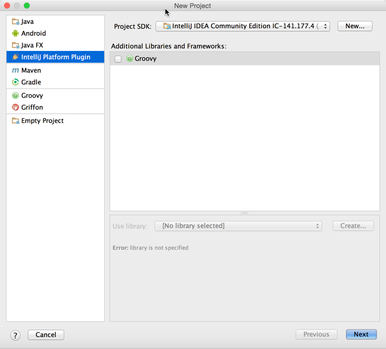

#创建插件项目
这部分文档会介绍如何使用新建项目向导从头开始新建一个插件项目。当然，你也可以从已经存在的项目中导入。也可以在已存在项目中创建一个插件模块。更多信息，请参考：[IntelliJ IDEA Web Help](https://www.jetbrains.com/idea/help/new-project-wizard.html)

##创建插件项目：
* 在主菜单中，选择File->New->Project打开新建项目向导。
 
* 选择左侧InteiilJ Platform Plugin类型
* 点击Next
* 输入项目名称
* 点击Finish创建项目相关文件
* 若需要调整项目配置，可点击File->Project Structure进行调整

