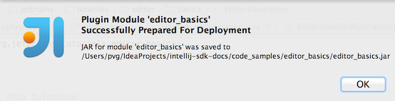
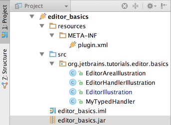

# 部署插件
只有插件部署后，也即构建、安装，且在插件管理器中激活，才能使用改插件相关功能。
部署插件步骤：
* 选择菜单`Build->Make Project`构建工程
* 选择菜单Build->Prepare Plugin Module ‘<module name>` for Deployment，生产插件部署文件。
  
* 如果插件并没有依赖其他三方包，那么就会生成一个jar包。否则会生成一个包含三方依赖的zip压缩包。
  

* 将生成的jar包或者zip压缩包拷贝到`.IntelliJIDEAx0\config\plugins`文件夹下，并重启IDE生效。具体如何找到需要拷贝到的插件文件夹路径，请参考[IDE设置、缓存、日志和插件](/basics/settings_caches_logs.md)。
  
* 选择菜单`File->Setting`打开配置对话框。
* 在配置对话框中，点击`Plugins`。
* 然后在右侧区域，打开`Installed`标签，将刚才的插件右侧的复选框勾上。
* 点击OK关闭配置对话框
* 重启生效

