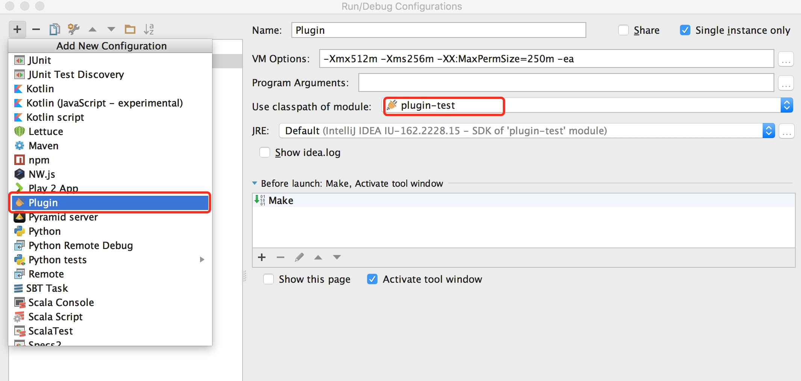

# 运行/调试插件
IntelliJ平台允许直接在IDE中运行或者调试插件。为了能够在IDEA中运行或调试插件，需要配置指定需要运行的类，虚拟机参数和其他特定配置。大多数时候，可以直接使用插件工程的默认运行/调试配置。
关于如何修改运行/调试配置，参考：[运行/调试配置](http://www.jetbrains.com/idea/help/run-debug-configuration.html)和IntelliJ IDEA文档中的[运行/调试配置：插件](http://www.jetbrains.com/idea/help/run-debug-configuration-plugin.html)部分。
通过IDEA的调试器，可以得到运行时错误和异常的原始信息。

## 调试插件
选择菜单Run->Debug，或者使用快捷键`Shift + F9`。
## 运行插件
选择菜单Run->Run，或者使用快捷点`Shift + F10`。

译者注：运行或调试插件时，若没有默认的运行配置，则可以新建一个。在新建配置时，选择plugin类型，并指定使用插件Module的class即可。如下图：

