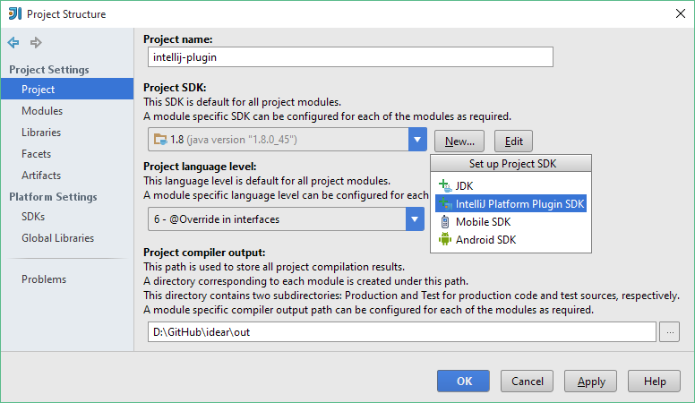
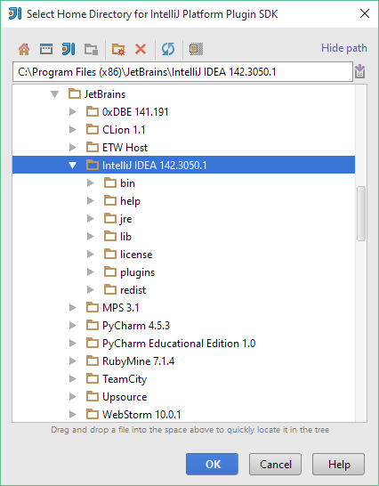
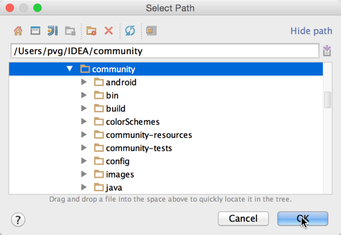
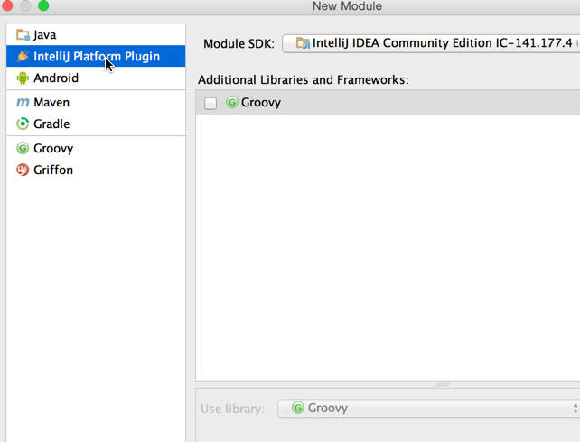
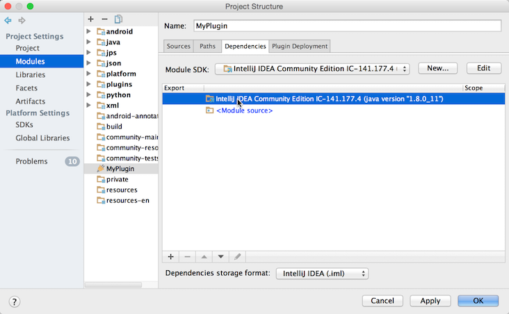

#配置开发环境
## 准备步骤
* **IntelliJ IDEA**：安装9.0及更新版本
* **IntelliJ IDEA社区版源码**：这一步非必须，但源码能帮助我们更好的调试插件。关于源码检出，请参见：[检出并构建IntelliJ IDEA社区版](http://www.jetbrains.org/intellij/sdk/docs/basics/checkout_and_build_community.html)
* **插件开发工具包**需要被启用
* **IntelliJ 平台SDK**配置，具体参见：[配置IntelliJ平台SDK](http://www.jetbrains.org/intellij/sdk/docs/basics/getting_started/setting_up_environment.html#configuring-intellij-platform-sdk)

##配置IntelliJ平台SDK
配置插件开发环境：
* 检出IntelliJ IDEA社区版代码（[检出并构建IntelliJ IDEA社区版](http://www.jetbrains.org/intellij/sdk/docs/basics/checkout_and_build_community.html)）
* 创建IntelliJ平台SDK
打开File->Project Structure：

* 选择社区版的安装目录

* 选择在[检出并构建IntelliJ IDEA社区版](http://www.jetbrains.org/intellij/sdk/docs/basics/checkout_and_build_community.html)中创建的IDEA JDK为默认的JDK版本

* 在SDK配置界面的源码路径Tab中，点击Add：

* 选择IntelliJ社区版源码检出路径

* 选择菜单File->New->Module，并选中IntelliJ Platform Plugin模块类型

* 输入插件名称
* 选择菜单：File->Project Structure，选中最新创建的模块，并将IntelliJ Platform SDK配置为模块的SDK

