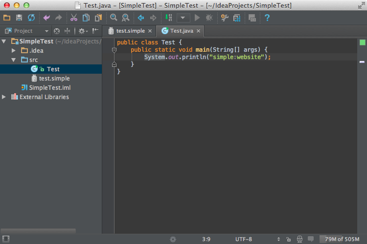

Annotator helps highlight and annotate any code based on specific rules.

### 7.1. Define an annotator

In this tutorial we will annotate usages of our properties within Java code.
Let's consider a literal which starts with *"simple:"* as a usage of our property.

```java

```

### 7.2. Register the annotator

```xml
<annotator language="JAVA" implementationClass="com.simpleplugin.SimpleAnnotator"/>
```

### 7.3. Run the project

Let's define the following Java file and check if the IDE resolves a property.

```java
public class Test {
    public static void main(String[] args) {
        System.out.println("simple:website");
    }
}
```



If we type an undefined property name, it will annotate the code with a error.


[Previous](psi_helper_and_utilities.md)
[Top](/tutorials/custom_language_support_tutorial.md)
[Next](line_marker_provider.md)

