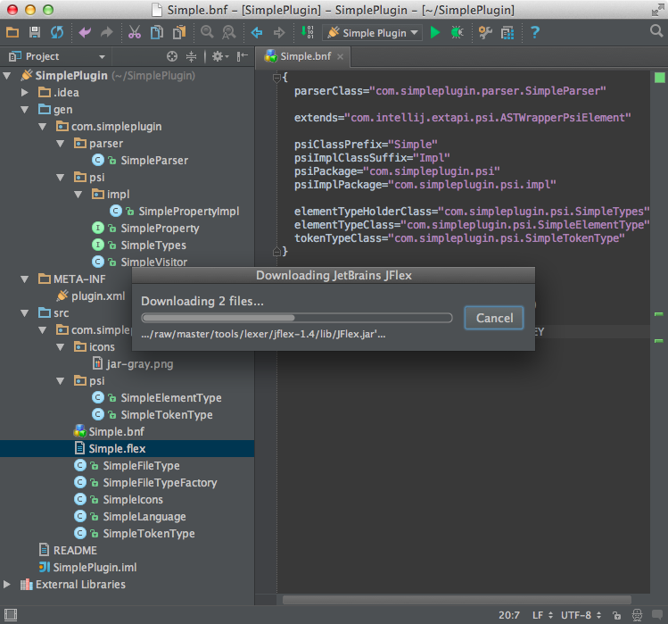
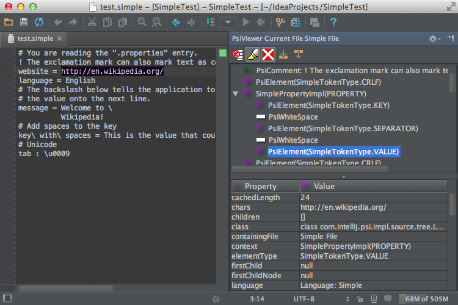

The lexer defines how the contents of a file is broken into tokens.
The easiest way to create a lexer is to use [JFlex](http://jflex.de/)

### 4.1. Define a lexer

Define */com/simpleplugin/Simple.flex* file with rules for our lexer.

```java

```

### 4.2. Generate a lexer class

Now we can generate a lexer class via *JFlex Generator* from the context menu on `Simple.flex` file.
The Grammar-Kit plugin uses JFlex lexer generation.
If you run it for the first time it will offer you to choose a folder to download the JFlex library and skeleton to.
Choose the project root directory.



After that the IDE will generate lexer: *com.simpleplugin.SimpleLexer*.

### 4.3. Define an adapter

```java

```

### 4.4. Define a file

```java

```

### 4.5. Define a parser definition

```java

```

### 4.6. Register the parser definition

```xml
<lang.parserDefinition language="Simple" implementationClass="com.simpleplugin.SimpleParserDefinition"/>
```

### 4.7. Run the project

Create a properties file with the following content:

```
# You are reading the ".properties" entry.
! The exclamation mark can also mark text as comments.
website = http://en.wikipedia.org/
language = English
# The backslash below tells the application to continue reading
# the value onto the next line.
message = Welcome to \
          Wikipedia!
# Add spaces to the key
key\ with\ spaces = This is the value that could be looked up with the key "key with spaces".
# Unicode
tab : \u0009
```

Now open the *PsiViewer* tool window and check how the lexer brake the content of the file into tokens, and the parser parsed the tokens into PSI elements.



----------------

[Previous](grammar_and_parser.md)
[Top](/tutorials/custom_language_support_tutorial.md)
[Next](syntax_highlighter_and_color_settings_page.md)

