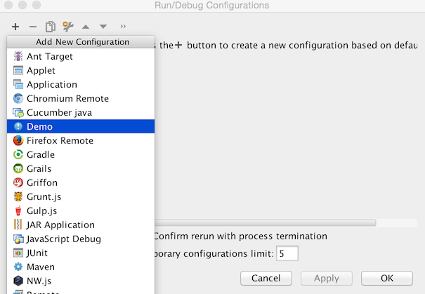

These series of steps show how to register and implement a simple Run Configuration.
Run Configurations are used to run internal and external processes from within *IntelliJ Platform* based products.
To get familiar with the concept of a Run Configuration refer
[Run/Debug Configuration](https://www.jetbrains.com/idea/help/run-debug-configuration.html)
section of 
[IntelliJ IDEA Web Help](https://www.jetbrains.com/idea/help/intellij-idea.html)

## Pre-requirements

Create an empty plugin project.
See 
[Creating a Plugin Project](/basics/getting_started/creating_plugin_project.md).

## 1. Register a new ConfigurationType

Add new *configurationType* extension to the 
[plugin.xml](https://github.com/JetBrains/intellij-sdk-docs/blob/master/code_samples/run_configuration/resources/META-INF/plugin.xml)

```xml
<extensions defaultExtensionNs="com.intellij">
  <configurationType implementation="org.jetbrains.tutorials.run.configuration.DemoRunConfigurationType"/>
</extensions>
```

## 2. Implement ConfigurationType

Implement 
[ConfigurationType](upsource:///platform/lang-api/src/com/intellij/execution/configurations/ConfigurationType.java) 
interface registered in the Step 1.

```java
public class DemoRunConfigurationType implements ConfigurationType {
    @Override
    public String getDisplayName() {
        return "Demo";
    }

    @Override
    public String getConfigurationTypeDescription() {
        return "Demo Run Configuration Type";
    }

    @Override
    public Icon getIcon() {
        return AllIcons.General.Information;
    }

    @NotNull
    @Override
    public String getId() {
        return "DEMO_RUN_CONFIGURATION";
    }

    @Override
    public ConfigurationFactory[] getConfigurationFactories() {
        return new ConfigurationFactory[]{new DemoConfigurationFactory(this)};
    }
}
```

## 3. Implement a ConfigurationFactory

Implement a new
[ConfigurationFactory](upsource:///platform/lang-api/src/com/intellij/execution/configurations/ConfigurationFactory.java)
through which custom run configurations will be created.

```java
public class DemoConfigurationFactory extends ConfigurationFactory {
    private static final String FACTORY_NAME = "Demo configuration factory";

    protected DemoConfigurationFactory(ConfigurationType type) {
        super(type);
    }

    @Override
    public RunConfiguration createTemplateConfiguration(Project project) {
        return new DemoRunConfiguration(project, this, "Demo");
    }

    @Override
    public String getName() {
        return FACTORY_NAME;
    }
}

```

## 4. Implement a Run Configuration

To make your changes visible from the UI, implement a new Run Configuration.

**Note:** In most of the cases you can derive a custom Run Configuration class from the
[RunConfigurationBase](upsource:///platform/lang-api/src/com/intellij/execution/configurations/RunConfigurationBase.java).
If you need to implement specific settings externalization rules and I/O behaviour, 
use 
[RunConfiguration](upsource:///platform/lang-api/src/com/intellij/execution/configurations/RunConfiguration.java)
interface.

```java
public class DemoRunConfiguration extends RunConfigurationBase {
    protected DemoRunConfiguration(Project project, ConfigurationFactory factory, String name) {
        super(project, factory, name);
    }

    @NotNull
    @Override
    public SettingsEditor<? extends RunConfiguration> getConfigurationEditor() {
        return new DemoSettingsEditor();
    }

    @Override
    public void checkConfiguration() throws RuntimeConfigurationException {

    }

    @Nullable
    @Override
    public RunProfileState getState(@NotNull Executor executor, @NotNull ExecutionEnvironment executionEnvironment) throws ExecutionException {
        return null;
    }
}
```

## 5. Create and Implement Run Configuration UI Form

Create a new 
[UI form] 
that defines, how an inner part of the new Run Configuration should look like.
Default Run Configuration will be looking like this:


## 6. Bind the UI Form

The UI Form should be bound with a Java class responsible for handling UI components logic.

```java
public class DemoSettingsEditor extends SettingsEditor<DemoRunConfiguration> {
    private JPanel myPanel;
    private LabeledComponent<ComponentWithBrowseButton> myMainClass;

    @Override
    protected void resetEditorFrom(DemoRunConfiguration demoRunConfiguration) {

    }

    @Override
    protected void applyEditorTo(DemoRunConfiguration demoRunConfiguration) throws ConfigurationException {

    }

    @NotNull
    @Override
    protected JComponent createEditor() {
        return myPanel;
    }

    private void createUIComponents() {
        myMainClass = new LabeledComponent<ComponentWithBrowseButton>();
        myMainClass.setComponent(new TextFieldWithBrowseButton());
    }
}
```

## 7. Compile and Run the Plugin

Refer to 
[Running and Debugging a Plugin](/basics/getting_started/running_and_debugging_a_plugin.md).

After going through the steps described above you can create a custom Run Configuration
from your plugin.


